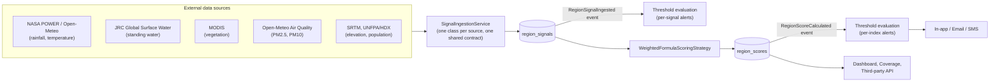

# KlimateIQ — Climate-Health Intelligence Platform

Winner of NigComSat Accelerator 3.0, Track C: Public Health Intelligence.

**Live**: [klimateiq.org](https://klimateiq.org) (product site) · [app.klimateiq.org](https://app.klimateiq.org) (the platform itself, deployed on AWS — EC2 + managed RDS Postgres)

**How this actually stands up right now**, not aspirationally:

- **774 real Nigerian LGAs** seeded with real coordinates and real 2020 UNFPA/US Census population figures — not placeholder data
- **8 live signal sources** feeding **6 named risk indices**, with automatic fallback so no single data provider is a point of failure — see [`docs/MODEL.md`](docs/MODEL.md) for the exact formulas and [`docs/INGESTION_GUIDE.md`](docs/INGESTION_GUIDE.md) for the resilience pattern
- **147 automated tests, all passing** — `php artisan test`
- Real transactional email (Resend), real error tracking (Sentry), real production monitoring (a Pipeline Health dashboard showing queue depth and per-source data freshness) — not just a demo path

## The problem

Nigeria carries the world's heaviest malaria burden by a wide margin. Per WHO's most recent
global malaria fact sheet: 610,000 people died of malaria worldwide in 2024, 579,000 of them
(95%) in the WHO African Region — and Nigeria alone accounts for 31.9% of the Region's deaths,
roughly 30% of the entire world's malaria deaths concentrated in one country. About three-quarters
of Regional malaria deaths are children under five.

Malaria isn't the only climate-linked health risk that follows a predictable pattern, either.
Anopheles mosquitoes breed in standing water, and outbreaks typically follow rainfall and flooding
by 2–4 weeks — the incubation window for mosquito populations to build and transmission to spread.
Heat stress, drought-driven food insecurity, and — during harmattan season — respiratory illness
from airborne dust all follow their own environmental lead indicators the same way. In every case,
the underlying environmental data already exists: satellites and reanalysis models measure
rainfall, standing water, temperature, vegetation stress, and air quality continuously. What
doesn't exist, for most health agencies, is the layer that turns "it rained 90mm this week" into
"intervene in this LGA now" — regionally specific, tied to a real threshold, and reaching the
person who can act on it before the lag window closes.

## The solution

KlimateIQ ingests environmental signals per Nigerian LGA, fuses them into named, purpose-built
risk indices — not one blended score — lets health agencies configure their own thresholds and
alerts per region, and gives every user a dashboard scoped to what they're actually responsible
for, not the whole country.

**Three independently scalable layers:**

1. **Spatial Processing Layer** — scheduled/queued ingestion jobs pull environmental signals per
   region, normalized into a common `region_signals` table.
2. **Alerts & Notification Layer** — reacts only to `RegionScoreCalculated` /
   `RegionSignalIngested` *events*; it never calls into ingestion or scoring directly, so any
   layer can be deployed, scaled, or replaced independently of the others.
3. **User Interface Layer** — the dashboard, threshold configuration, and a documented
   third-party read API.



### Named indices, not one blended score

| Index | Built from | Useful for |
|---|---|---|
| **Malaria Risk Index** | Rainfall + standing water | Malaria programme officers |
| **Flood Risk Index** | Rainfall + standing water + elevation | Emergency response |
| **Heat Stress Risk Index** | Temperature + vegetation loss | Occupational and public heat-health planning |
| **Drought Risk Index** | Rainfall deficit + vegetation stress | Agricultural and water-security planning |
| **Respiratory Risk Index** | PM2.5 + PM10 particulate matter | Air-quality and respiratory-health planning, especially harmattan/dust season |
| **Composite Climate-Health Pressure Index** | All active signals, weighted | Overall regional snapshot |

Adding another index is a new row in `region_scoring_configs` — no code change. Every score
traces back to exactly which signal drove it (see the breakdown on any region's drill-down page,
or `region_scores.breakdown` directly) — the exact formula, every index's real weights, and
every calibration bound with its source are all written out in full in
[`docs/MODEL.md`](docs/MODEL.md).

### AI, honestly scoped

- **Scoring** — `WeightedFormulaScoringStrategy` is what's live today: transparent, calibrated,
  explainable. `TrainedModelScoringStrategy` is a genuine architectural seam (same interface, same
  input/output shape) — see [`docs/MODEL.md`](docs/MODEL.md#two-scoring-strategies-by-design) for
  what activating it requires once historical case data is available.
- **Alerting** — thresholds can be a fixed value *or* an anomaly against a region's own rolling
  baseline (mean/stddev over its recent history) — genuinely adaptive, not a fixed rule.
- **Reporting** — an OpenAI-powered summary turns a score's breakdown into a short plain-English
  explanation, restricted to only restating data already computed, cached alongside the score.

## What's under the hood

| Layer | Choice |
|---|---|
| Backend | Laravel 13 (PHP 8.3) |
| Frontend | Livewire 4 + Alpine.js, Tailwind 4 |
| Database | PostgreSQL 17 |
| Cache / sessions / queue | Redis |
| Queue worker | `systemd`-managed, auto-restarting |
| Scheduler | Laravel's own, driven by cron |
| Hosting | AWS EC2 (Amazon Linux 2023) + RDS Postgres, Nginx + PHP-FPM |
| Email | Resend |
| Error tracking | Sentry |
| Auth (third-party API) | Laravel Sanctum |

A single server-rendered stack (Laravel/Livewire) rather than a separate frontend/backend/ML
service split was a deliberate choice for a product whose core value is a configurable dashboard
and alerting engine, not a standalone inference service — it let the team ship a fully tested,
deployed, production-monitored platform in the time available, not a stack decision made for its
own sake.

### Where the code actually lives

```
app/Services/Ingestion/   one class per data source, all implementing SignalIngestionService
app/Services/Scoring/     WeightedFormulaScoringStrategy, the trained-model seam, the resolver
app/Services/Alerts/      threshold evaluation — fixed value or rolling-baseline anomaly
app/Services/Ai/          OpenAI-backed score summaries
app/Notifications/        ThresholdBreachedNotification — in-app, email, SMS
app/Console/Commands/     signals:ingest, scores:calculate, signals:backfill-history, ...
docs/MODEL.md             the exact scoring formula, weights, and calibration sources
docs/INGESTION_GUIDE.md   how to plug in a new signal source or index — no code change needed
```

## Data sources

| Signal | Source | Status |
|---|---|---|
| Rainfall | NASA POWER, falls back to Open-Meteo (ERA5) | Live |
| Standing water | JRC Global Surface Water | Live |
| Temperature | NASA POWER, falls back to Open-Meteo (ERA5) | Live |
| Vegetation/humidity | MODIS (via NASA Earthdata/AppEEARS) | Live |
| Elevation | SRTM (Open Topo Data) | Live |
| Population exposure | UNFPA/US Census Bureau via HDX (2020 LGA-level projection) | Live, but not a per-request API pull — see [`docs/INGESTION_GUIDE.md`](docs/INGESTION_GUIDE.md#population-exposure) for what that means |
| Air quality (PM2.5, PM10) | Open-Meteo Air Quality API (CAMS) | Live |

No single provider is the platform's entire data backbone by design — see
[`docs/INGESTION_GUIDE.md`](docs/INGESTION_GUIDE.md#resilience-no-single-provider-is-a-single-point-of-failure)
for the resilience/fallback pattern and how a new source plugs in without touching scoring or
alerting.

All 774 real Nigerian LGAs are seeded (name, state, coordinates). Ingestion is usage-driven — a
region only gets pulled once someone actually watches it or requests it via Coverage, so the
platform doesn't waste cycles ingesting every LGA nobody's asked about.

## Alert channels, today

| Channel | Status |
|---|---|
| In-app | Live — the always-on baseline every user gets |
| Email | Live, via Resend, with a branded template |
| SMS | Built and tested end-to-end (including graceful no-op when unconfigured — see `tests/Feature/NotificationChannelsTest.php`), pending a production Termii account |

Each user chooses their own channels per alert type; a platform-wide switch can also disable
email outright without touching individual preferences. SMS being pending isn't a gap in the
code — `App\Notifications\Channels\SmsChannel` and `App\Services\Sms\TermiiSmsClient` are fully
implemented and covered by tests; it's waiting on a business account, not engineering.

## Setup

Requires PHP 8.3+, Postgres, Node 18+.

```bash
composer install
npm install
php artisan key:generate
```

Create a `.env` with `DB_CONNECTION=pgsql` and your database credentials. A handful of
integrations are optional and degrade gracefully without a key — email alerts (`RESEND_API_KEY`),
SMS alerts (`TERMII_API_KEY`), AI score summaries (`OPENAI_API_KEY`), Vegetation ingestion
(`NASA_EARTHDATA_USERNAME`/`NASA_EARTHDATA_PASSWORD`, free account at
[urs.earthdata.nasa.gov](https://urs.earthdata.nasa.gov/)), and error tracking
(`SENTRY_LARAVEL_DSN` — see `config/sentry.php`, a free Sentry project supplies this). See
`config/services.php` and `config/ingestion.php` for exactly which variables each one reads.
Then:

```bash
php artisan migrate
php artisan db:seed
npm run build
```

## Run

```bash
php artisan serve
php artisan queue:work    # processes ingestion jobs and alert-evaluation listeners
```

Prove the pipeline end-to-end:

```bash
php artisan signals:ingest --sync   # pulls real rainfall data for all seeded regions, synchronously
php artisan scores:calculate        # computes every index for every region
```

Or on a schedule (already wired in `routes/console.php`):

```bash
php artisan schedule:work
```

## Tests

```bash
php artisan test
```

Uses a dedicated `gano_ai_test` Postgres database (see `phpunit.xml`) rather than SQLite — several
migrations use Postgres-specific constraints.

## Roadmap

Where the platform goes next — sector expansion (agriculture, disaster response, water,
climate planning), the additional indices each sector can carry, and the engineering for
each — is laid out in [`docs/ROADMAP_SECTORS.md`](docs/ROADMAP_SECTORS.md) and its code-level
companion [`docs/BUILD_PLAN.md`](docs/BUILD_PLAN.md).

Two things are engineering estimates today, not finished claims — stated plainly rather than
buried, because that's consistent with how the rest of the product works:

- **Agency membership is self-declared, not yet verified.** Anyone can select any existing agency
  (or type a new one) at signup. This gates "share with my agency" visibility on Saved Views and
  Reports today, and will matter more once cross-agency oversight exists. The planned fix —
  matching a user's email domain against a per-agency verified domain, with unverified claims held
  for admin review rather than silently trusted or blocked — is scoped, not built yet.

- **Scoring calibration bounds are climatologically plausible defaults, not yet clinically
  validated.** Only Vegetation's `-1` to `1` range is a genuine scientific standard (NDVI's own
  definition); the rest — including the new US-EPA-AQI-sourced air-quality bounds — are reasonable,
  cited engineering estimates for Nigeria, not numbers checked against real health-outcome data
  yet. `TrainedModelScoringStrategy` (see [`docs/MODEL.md`](docs/MODEL.md)) is the built, tested
  seam for closing that gap once historical case data is available to calibrate against.

## Third-party API

Token-authenticated (Sanctum), read-only access to the same scores the dashboard renders — the
integration surface for another agency's own dashboard, without them rebuilding ingestion or
scoring.

Issue a token: **Admin → API Tokens** in the dashboard, or `POST /admin/api-tokens`.

| Endpoint | Returns |
|---|---|
| `GET /api/v1/indices` | Every named index (code, name, description) |
| `GET /api/v1/regions` | Every seeded region (name, state, LGA code, coordinates, population) |
| `GET /api/v1/indices/{indexCode}/scores` | Latest score per region for one index; `?region_id=` to scope to one region |
| `GET /api/v1/regions/{region}/scores` | Full score history for one region; `?index=` to choose which index (defaults to Composite Climate-Health Pressure) |

```bash
curl https://app.klimateiq.org/api/v1/indices/MALARIA_RISK/scores \
  -H "Authorization: Bearer YOUR_TOKEN" \
  -H "Accept: application/json"
```
